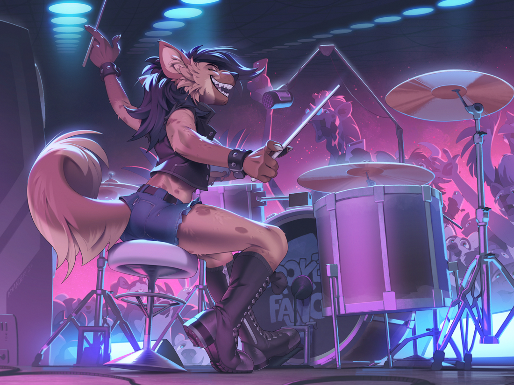
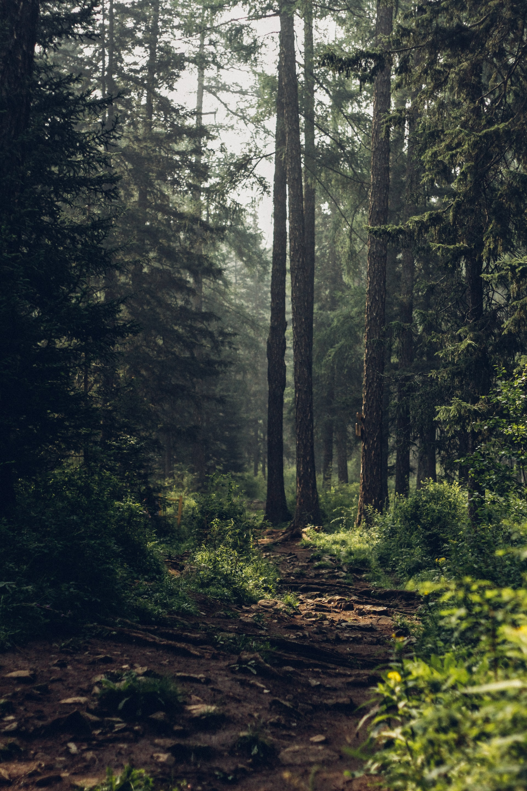
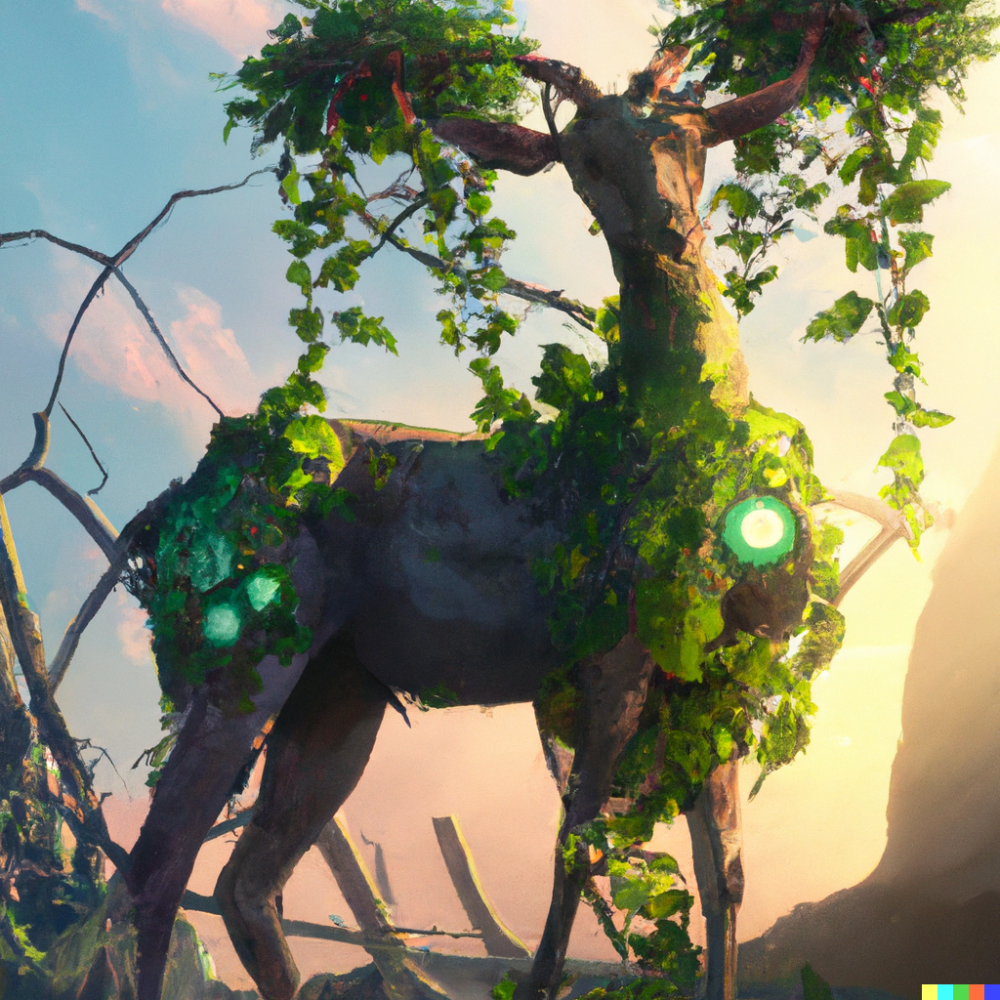
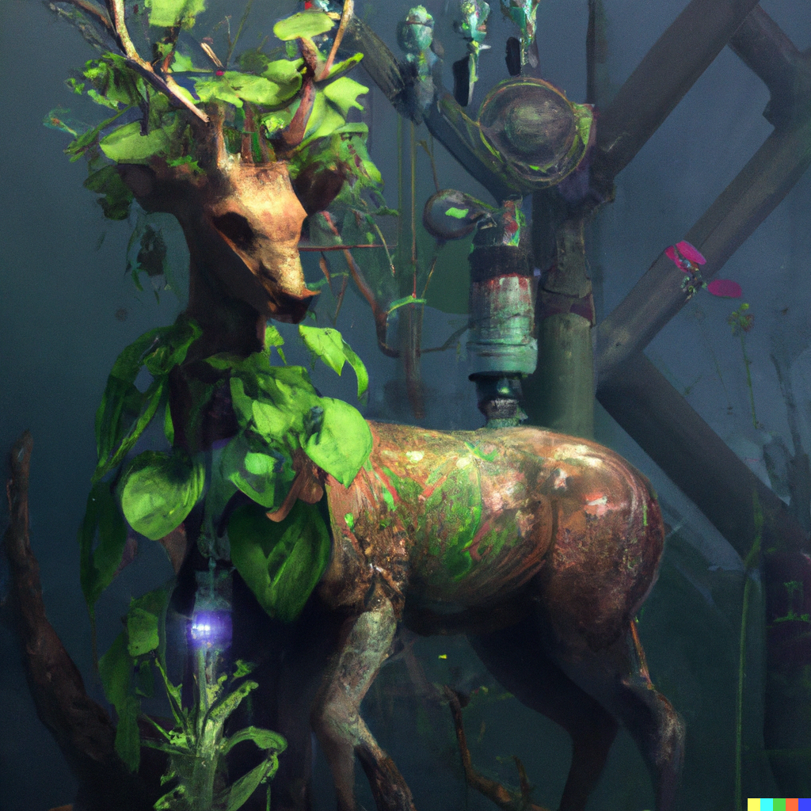
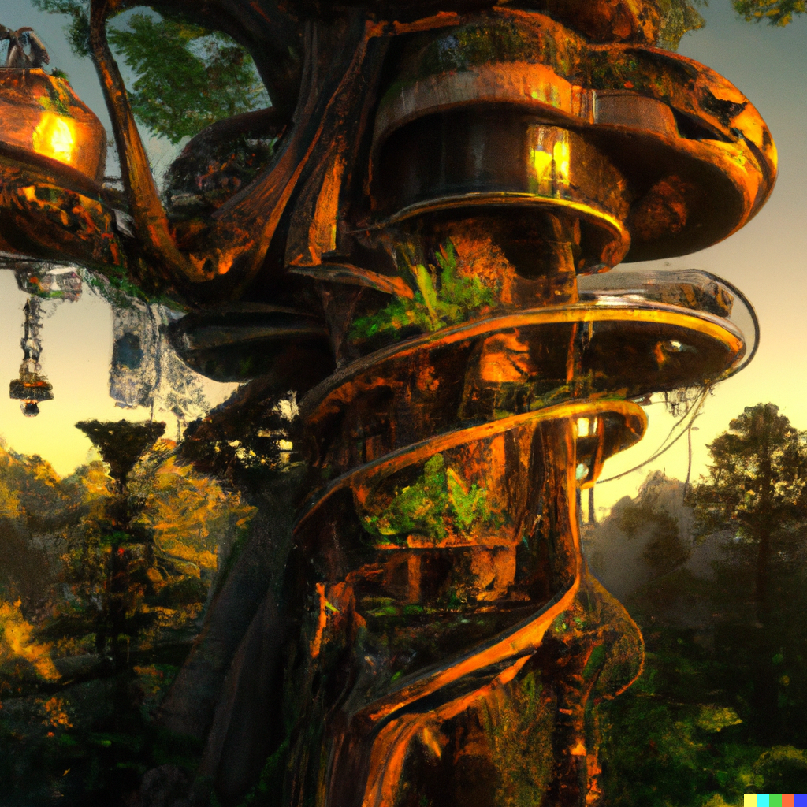
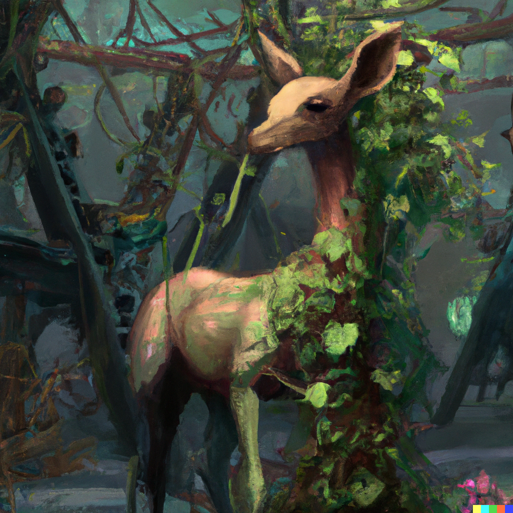
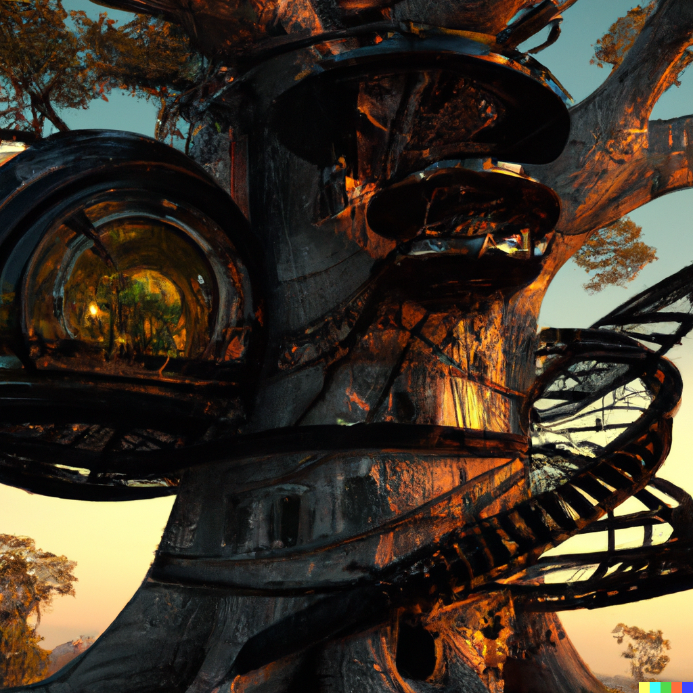
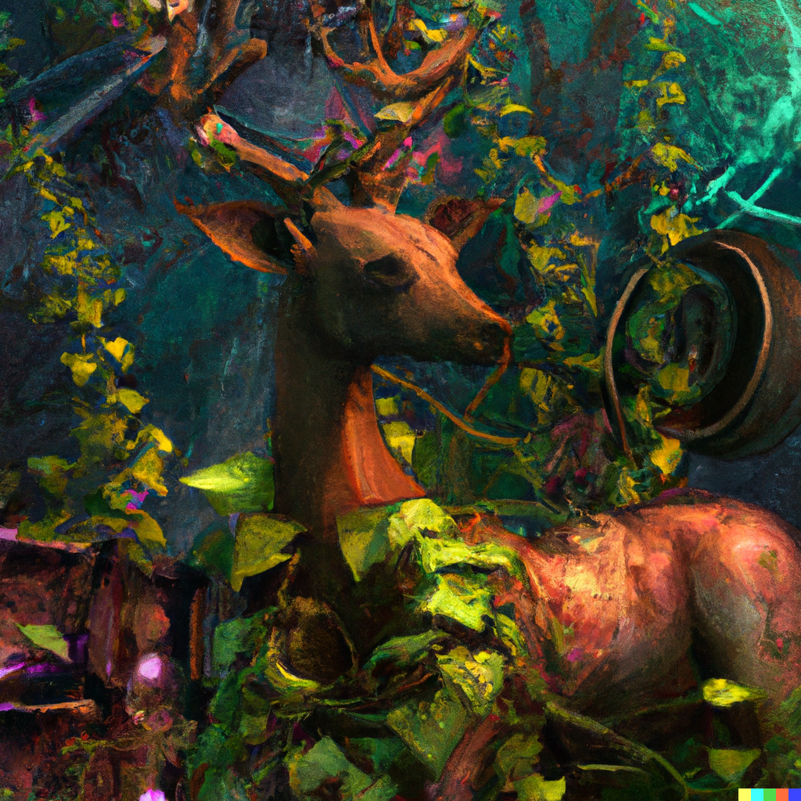
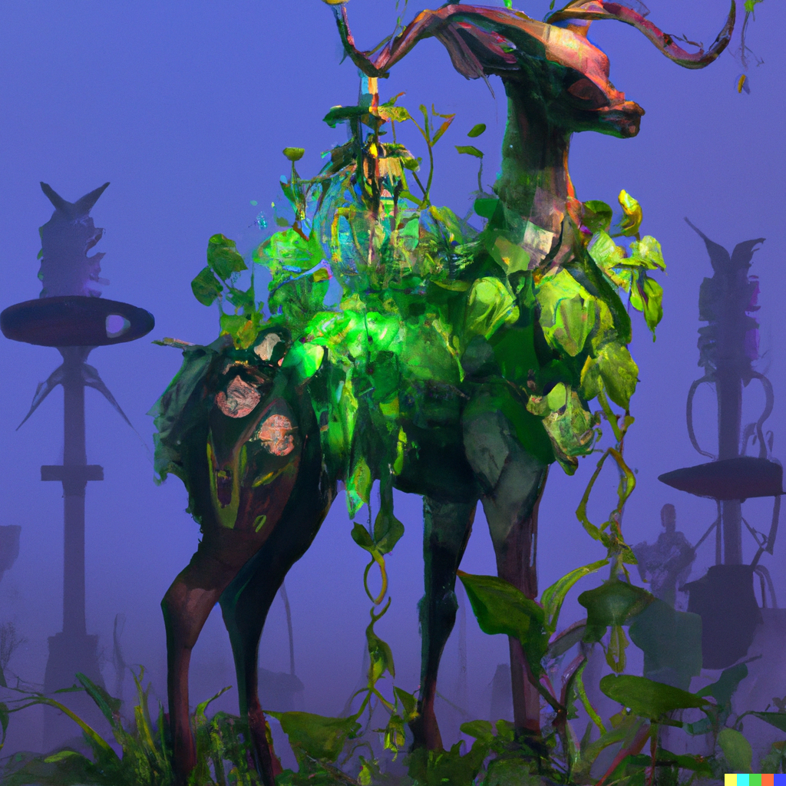

# All the Info™

- [All the Info™](#all-the-info)
  - [Description](#description)
    - [Physical](#physical)
    - [Lore](#lore)
    - [Ref Sheet](#ref-sheet)
  - [Images](#images)
    - [Reference](#reference)
    - [Moodboard](#moodboard)
    - [AI Generated Stuff](#ai-generated-stuff)

---

## Description

### Physical

- Red/black/white anthro deer
- Hooves
- Leaves on antlers
- Plenty of scars/nicks on lower arms from spending so much time outdoors/with machinery

### Lore

- Environmentalist
- Programmer & musician
- Lives in an outpost built into the trunk of a massive tree
- Maintains a large garden
- Blacked out the moon he lives on, specifically to avoid it being scalped of all its resources

### Ref Sheet

- Bagelcollie's sketch is good, we can work off of that
- Not clothed

---

## Images

### Reference

(For fur pattern/deer type reference, I guess):

### Moodboard

### AI Generated Stuff

